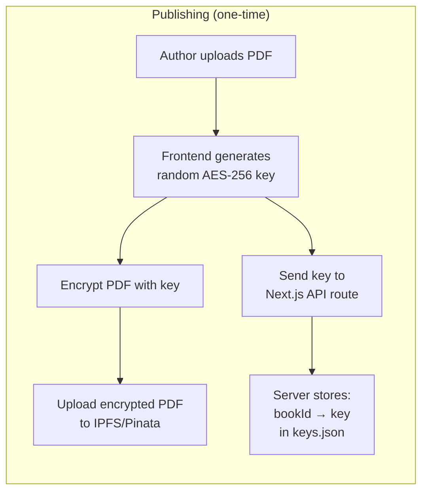
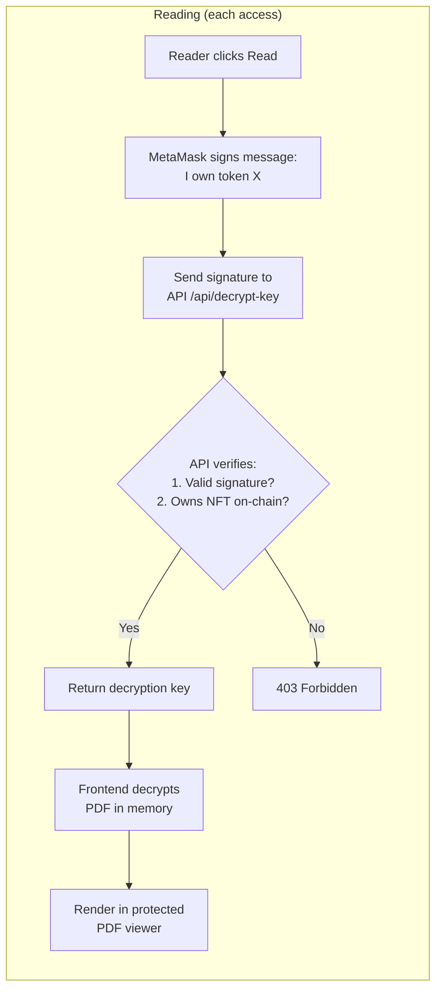
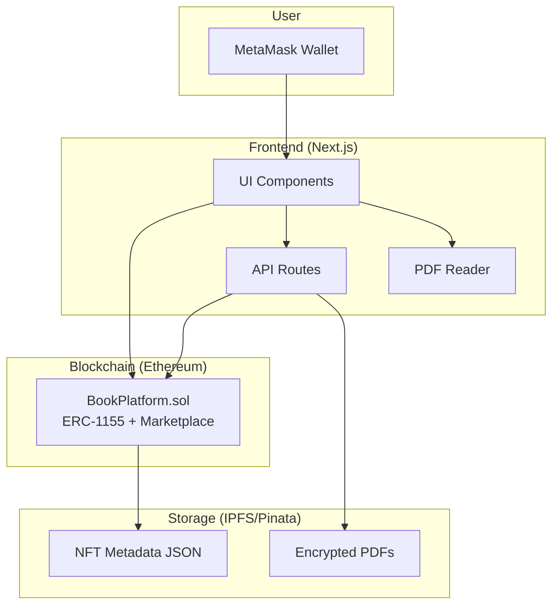
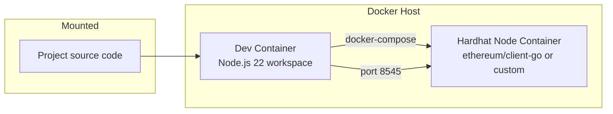
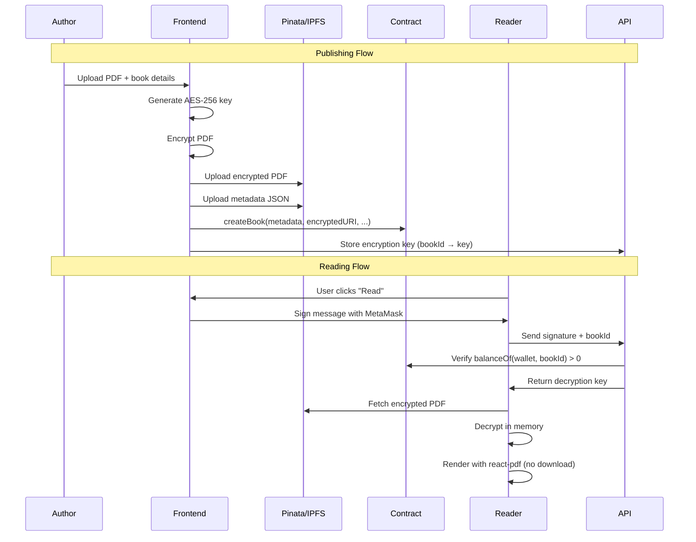

# Decentralized Book Publishing & Royalty Distribution Platform

A blockchain-based book marketplace where authors publish books as NFTs, readers purchase copies, and royalties are automatically distributed via smart contracts. Books are stored encrypted on IPFS and accessed through a protected web reader.

---

## How Encryption Key Storage Works

The anti-piracy system relies on **encrypting the PDF before uploading to IPFS** and controlling who gets the decryption key.





**Why server-side storage?** The encryption key can't live on-chain (it would be publicly visible). IPFS is also public. So we store keys on the Next.js server in a `keys.json` file. The API only releases a key after proving NFT ownership via wallet signature + on-chain check.

**Tradeoffs for a course project:**
- ✅ Simple to implement, works well for demos
- ⚠️ Server admin can see all keys (centralized trust)
- ⚠️ If server dies without backup, keys are lost
- 🔮 Production alternative: [Lit Protocol](https://litprotocol.com/) for decentralized access control

---

## Architecture Overview



### Key Design Decisions

| Decision | Choice | Rationale |
|----------|--------|-----------|
| Contract pattern | Single contract (ERC-1155 + marketplace) | ERC-1155 supports multiple copies per book natively, more gas-efficient |
| Encryption | AES-256-GCM via Web Crypto API | Browser-native, no extra dependencies |
| Key storage | Next.js API route + server-side env | Practical for course project scope |
| PDF rendering | `react-pdf` (PDF.js wrapper) | Best React integration, disables download/print |
| Primary sale split | 90% authors / 10% platform | Per user requirement |
| Resale split | 30% authors / 60% seller / 10% platform | Fair distribution with platform sustainability |

---

## Project Structure

```
code/
├── .devcontainer/
│   ├── devcontainer.json         # Dev container config (DooD)
│   └── docker-compose.yml        # Multi-container dev environment
├── contracts/                    # Hardhat project
│   ├── contracts/
│   │   └── BookPlatform.sol      # Main smart contract (ERC-1155)
│   ├── scripts/
│   │   └── deploy.js             # Deployment script
│   ├── test/
│   │   └── BookPlatform.test.js  # Contract tests
│   ├── hardhat.config.js
│   └── package.json
├── frontend/                     # Next.js project
│   ├── src/
│   │   ├── app/                  # App Router pages
│   │   │   ├── layout.js
│   │   │   ├── page.js           # Home / marketplace
│   │   │   ├── publish/page.js   # Author: publish a book
│   │   │   ├── book/[id]/page.js # Book detail + buy
│   │   │   ├── library/page.js   # My purchased books
│   │   │   ├── read/[bookId]/page.js   # Protected PDF reader
│   │   │   └── resale/page.js    # Resale marketplace
│   │   ├── components/
│   │   │   ├── Navbar.js
│   │   │   ├── WalletButton.js
│   │   │   ├── BookCard.js
│   │   │   ├── PublishForm.js
│   │   │   ├── PDFReader.js
│   │   │   └── ResaleModal.js
│   │   ├── contexts/
│   │   │   └── WalletContext.js  # MetaMask connection state
│   │   ├── lib/
│   │   │   ├── contract.js       # Contract ABI + helpers
│   │   │   ├── pinata.js         # Pinata upload helpers
│   │   │   ├── encryption.js     # AES-256 encrypt/decrypt
│   │   │   └── constants.js      # Addresses, config
│   │   └── api/                  # Next.js API routes
│   │       └── decrypt-key/route.js  # Verify ownership → return key
│   ├── public/
│   ├── next.config.js
│   └── package.json
└── README.md
```

---

## Proposed Changes

### Dev Container (Docker-outside-of-Docker)

The dev environment uses **Docker-outside-of-Docker (DooD)** so the devcontainer can spin up sibling containers for services like the Hardhat node. This keeps concerns separated (microservices pattern) and makes the dev environment more robust.



#### [NEW] [devcontainer.json](file:///media/MasterBait/code/SEM3/blockchain/course-project/code/.devcontainer/devcontainer.json)

- Uses `docker-compose.yml` for multi-container orchestration
- Main service: `workspace` (Node.js 22, the dev container VS Code connects to)
- Feature: **docker-outside-of-docker** (`ghcr.io/devcontainers/features/docker-outside-of-docker`) — gives the workspace container access to the host Docker socket so it can manage sibling containers
- VS Code extensions: Solidity (`JuanBlanco.solidity`), ESLint, Prettier, Hardhat (`NomicFoundation.hardhat-solidity`)
- `postCreateCommand`: `cd contracts && npm install && cd ../frontend && npm install`
- Forward ports: `3000` (Next.js), `8545` (Hardhat node)

#### [NEW] [docker-compose.yml](file:///media/MasterBait/code/SEM3/blockchain/course-project/code/.devcontainer/docker-compose.yml)

Two services:

| Service | Image | Purpose | Port |
|---------|-------|---------|------|
| `workspace` | `mcr.microsoft.com/devcontainers/javascript-node:22` | Main dev environment (VS Code attaches here) | `3000` |
| `hardhat-node` | `node:22-slim` + entrypoint runs `npx hardhat node` | Persistent local blockchain node | `8545` |

- The `hardhat-node` service mounts `../contracts` so it has access to the Hardhat config and contracts
- The `workspace` service connects to `hardhat-node:8545` for deployment and testing
- Both services are on the same Docker network so they can communicate by service name
- The `hardhat.config.js` will use `hardhat-node` as the hostname for the localhost network instead of `127.0.0.1`

---

### Smart Contract — `BookPlatform.sol`

The single smart contract uses **ERC-1155** (multi-token standard) where each `bookId` is a token ID and each copy is a unit of that token. This is more gas-efficient than ERC-721 since multiple copies share one token ID.

#### [NEW] [BookPlatform.sol](file:///media/MasterBait/code/SEM3/blockchain/course-project/code/contracts/contracts/BookPlatform.sol)

**Storage structures:**
```solidity
struct Book {
    uint256 bookId;           // also the ERC-1155 token ID
    string metadataURI;       // IPFS URI for book metadata
    string encryptedBookURI;  // IPFS URI for encrypted PDF
    uint256 price;            // in wei
    uint256 maxCopies;        // 0 = unlimited
    uint256 mintedCopies;
    address[] authors;
    uint256[] royaltyShares;  // must sum to 10000 (basis points)
    bool active;
}

struct Listing {
    uint256 listingId;
    uint256 bookId;           // ERC-1155 token ID
    uint256 price;
    address seller;
    bool active;
}
```

**Key functions:**

| Function | Description |
|----------|-------------|
| `createBook(metadataURI, encryptedBookURI, price, maxCopies, authors[], royaltyShares[])` | Author creates a new book entry (new ERC-1155 token ID) |
| `buyBook(bookId)` | User pays `price`, mints 1 unit of token `bookId`, royalties auto-distributed (90% authors, 10% platform) |
| `listForResale(bookId, price)` | Owner lists 1 copy for resale (transfers 1 unit to contract as escrow) |
| `cancelListing(listingId)` | Cancel a resale listing (returns token to seller) |
| `buyResale(listingId)` | Buy a resale listing (30% authors, 60% seller, 10% platform) |
| `getBook(bookId)` | View book details |
| `uri(bookId)` | ERC-1155 standard: returns metadata URI |
| `withdraw()` | Platform owner withdraws accumulated fees |

**Royalty distribution logic (primary sale):**
```
Total = msg.value
Platform fee = 10% of Total
Author pool = 90% of Total
For each author[i]: payment = Author pool × royaltyShares[i] / 10000
```

**Royalty distribution logic (resale):**
```
Total = listing.price
Platform fee = 10% of Total
Author royalty = 30% of Total (split by royaltyShares)
Seller receives = 60% of Total
```

---

#### [NEW] [hardhat.config.js](file:///media/MasterBait/code/SEM3/blockchain/course-project/code/contracts/hardhat.config.js)

- Hardhat config with Solidity 0.8.20+
- Networks: `hardhat-node` (Docker service at `http://hardhat-node:8545`) and `sepolia` (via Alchemy/Infura RPC)
- Falls back to `localhost:8545` when not running in devcontainer
- Environment variables for private key and RPC URL

#### [NEW] [deploy.js](file:///media/MasterBait/code/SEM3/blockchain/course-project/code/contracts/scripts/deploy.js)

- Deploys `BookPlatform.sol`
- Logs deployed address
- Saves ABI + address to `frontend/src/lib/` for frontend consumption

#### [NEW] [BookPlatform.test.js](file:///media/MasterBait/code/SEM3/blockchain/course-project/code/contracts/test/BookPlatform.test.js)

Comprehensive tests covering:
- Book creation with single and multiple authors
- Purchasing a book (minting 1 unit of ERC-1155 token) and verifying royalty distribution
- Max copies enforcement (limited vs unlimited)
- ERC-1155 balance checks (`balanceOf(user, bookId) > 0` = owns a copy)
- Resale listing, buying, and cancellation
- Resale royalty distribution verification
- Edge cases: buying own book, buying when sold out, invalid royalty shares, listing without ownership

---

### Frontend — Next.js Application

#### [NEW] [WalletContext.js](file:///media/MasterBait/code/SEM3/blockchain/course-project/code/frontend/src/contexts/WalletContext.js)

React context for MetaMask wallet connection:
- `connectWallet()` — requests MetaMask accounts
- `account` — current connected address
- `provider` / `signer` — ethers.js provider and signer
- Auto-detect account/chain changes
- Network validation (ensure correct chain)

#### [NEW] [contract.js](file:///media/MasterBait/code/SEM3/blockchain/course-project/code/frontend/src/lib/contract.js)

- Exports contract ABI and deployed address
- Helper to get contract instance from signer
- Read-only contract instance from provider

#### [NEW] [pinata.js](file:///media/MasterBait/code/SEM3/blockchain/course-project/code/frontend/src/lib/pinata.js)

- `uploadEncryptedPDF(encryptedBuffer)` → returns IPFS hash
- `uploadMetadata(bookMetadata)` → returns IPFS metadata URI
- Uses Pinata API with JWT auth

#### [NEW] [encryption.js](file:///media/MasterBait/code/SEM3/blockchain/course-project/code/frontend/src/lib/encryption.js)

- `generateKey()` → generates random AES-256-GCM key
- `encryptPDF(pdfBuffer, key)` → returns encrypted buffer + IV
- `decryptPDF(encryptedBuffer, key, iv)` → returns decrypted PDF buffer
- Uses the native Web Crypto API (`crypto.subtle`)

#### [NEW] [page.js (Home/Marketplace)](file:///media/MasterBait/code/SEM3/blockchain/course-project/code/frontend/src/app/page.js)

- Displays all available books as cards
- Each card shows: cover, title, author(s), price (ETH), copies remaining
- "Buy" button triggers MetaMask transaction
- Search/filter functionality

#### [NEW] [publish/page.js](file:///media/MasterBait/code/SEM3/blockchain/course-project/code/frontend/src/app/publish/page.js)

Author publish flow:
1. Fill form: title, description, price, max copies, cover image
2. Add authors with wallet addresses and royalty percentages (must sum to 100%)
3. Upload PDF → client-side encrypt → upload encrypted to Pinata
4. Upload metadata JSON to Pinata
5. Call `createBook()` on smart contract
6. Store encryption key server-side (mapped to bookId)

#### [NEW] [book/[id]/page.js](file:///media/MasterBait/code/SEM3/blockchain/course-project/code/frontend/src/app/book/[id]/page.js)

Book detail page:
- Full book info from contract + IPFS metadata
- Author list with royalty splits
- Buy button (if not owned)
- "Read" button (if owned → navigates to reader)
- Copies sold / remaining

#### [NEW] [library/page.js](file:///media/MasterBait/code/SEM3/blockchain/course-project/code/frontend/src/app/library/page.js)

- Lists all NFTs owned by connected wallet
- "Read" and "List for Resale" buttons on each
- Shows resale status if already listed

#### [NEW] [read/[bookId]/page.js](file:///media/MasterBait/code/SEM3/blockchain/course-project/code/frontend/src/app/read/[bookId]/page.js)

Protected PDF reader:
1. User signs a message: `"Verify ownership of book #X at timestamp Y"`
2. Sends signature to `/api/decrypt-key` API route
3. API verifies: (a) signature matches wallet, (b) `balanceOf(wallet, bookId) > 0` on-chain
4. Returns decryption key
5. Frontend decrypts PDF in memory, renders via `react-pdf`
6. Anti-piracy: no download button, right-click disabled, print disabled, CSS `user-select: none`

#### [NEW] [resale/page.js](file:///media/MasterBait/code/SEM3/blockchain/course-project/code/frontend/src/app/resale/page.js)

Resale marketplace:
- Shows all active resale listings
- Buy button triggers `buyResale()` transaction
- Sellers can cancel their listings

#### [NEW] [route.js (API: decrypt-key)](file:///media/MasterBait/code/SEM3/blockchain/course-project/code/frontend/src/app/api/decrypt-key/route.js)

Next.js API route for access control:
1. Receives: `{ bookId, signature, message, walletAddress }`
2. Verifies signature using `ethers.verifyMessage()`
3. Calls contract `balanceOf(walletAddress, bookId)` to verify ownership (ERC-1155)
4. If `balance > 0` → returns the encryption key for that book
5. Keys stored on the server in a `keys.json` file (`bookId → { key, iv }`)

> [!IMPORTANT]
> The encryption key storage is the weakest link in the anti-piracy chain. For a course project, storing keys in a server-side JSON file is acceptable. See the [encryption explanation](#how-encryption-key-storage-works) at the top for the full flow diagram and tradeoffs.

---

### Encryption & Access Control Flow



---

## Implementation Order

| Phase | Steps | Estimated Work |
|-------|-------|---------------|
| **1. Smart Contracts** | Hardhat setup → `BookPlatform.sol` → Tests → Deploy script | Core foundation |
| **2. Frontend Scaffold** | Next.js init → Wallet context → Contract lib → Layout/Navbar | Project skeleton |
| **3. Publish Flow** | Pinata integration → Encryption lib → Publish page → API route for key storage | Author experience |
| **4. Marketplace** | Home page → Book detail → Buy flow → Royalty verification | Buyer experience |
| **5. Reader** | PDF reader component → Ownership verification API → Decrypt & render | Access control |
| **6. Library & Resale** | My library page → Resale listing → Resale marketplace | Secondary market |
| **7. Polish** | UI/UX refinement → Error handling → Loading states → Dark mode | Final touches |

---

## Verification Plan

### Automated Tests

**Smart Contract Tests** — run with:
```bash
cd /media/MasterBait/code/SEM3/blockchain/course-project/code/contracts
npx hardhat test
```

Test cases:
1. **Book creation** — verify book data stored correctly, events emitted
2. **Single-author purchase** — verify 90%/10% split, `balanceOf` increases
3. **Multi-author purchase** — verify royalty shares distributed correctly
4. **Limited copies** — verify minting stops at maxCopies
5. **Unlimited copies** — verify no cap enforcement
6. **Resale listing** — verify listing created, 1 unit transferred to contract escrow
7. **Resale purchase** — verify 30%/60%/10% split, buyer receives 1 unit
8. **Cancel listing** — verify 1 unit returned to seller
9. **Edge cases** — buying sold-out book, non-owner listing, zero price, invalid royalty shares

### Manual Verification (End-to-End)

These steps use the Docker-composed Hardhat node and the Next.js dev server:

1. **Start dev environment**: Open in devcontainer (docker-compose starts `hardhat-node` automatically)
2. **Deploy contracts**: `npx hardhat run scripts/deploy.js --network localhost` (routes to `hardhat-node` container)
3. **Start frontend**: `npm run dev` in `frontend/`
4. **Connect MetaMask** to localhost:8545 with Hardhat test accounts
5. **Publish a book**: Fill the form, upload a test PDF, set 2 authors with 60/40 split → verify transaction succeeds and book appears on marketplace
6. **Buy the book**: Switch to a different Hardhat account, buy the book → verify ETH balances changed correctly (90% to authors per split, 10% to contract)
7. **Read the book**: Click "Read" → sign message → verify PDF renders in the reader without download option
8. **List for resale**: List the purchased book at a new price → verify it appears in resale marketplace
9. **Buy resale**: Switch to a third account, buy the resale listing → verify 30% to authors, 60% to seller, 10% platform
